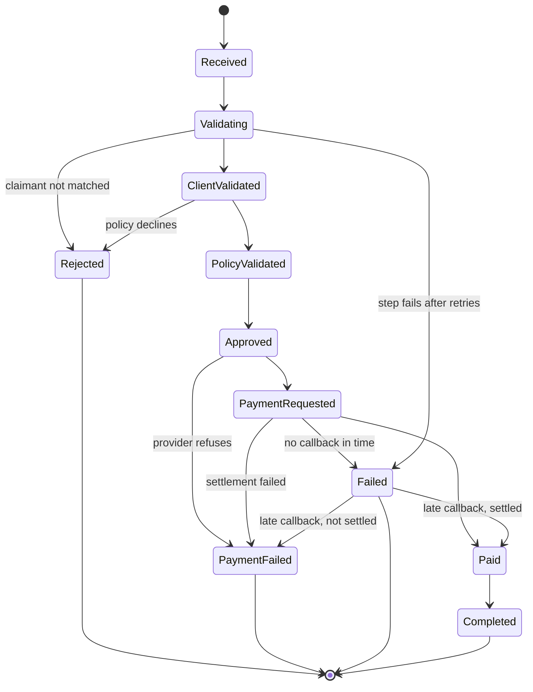
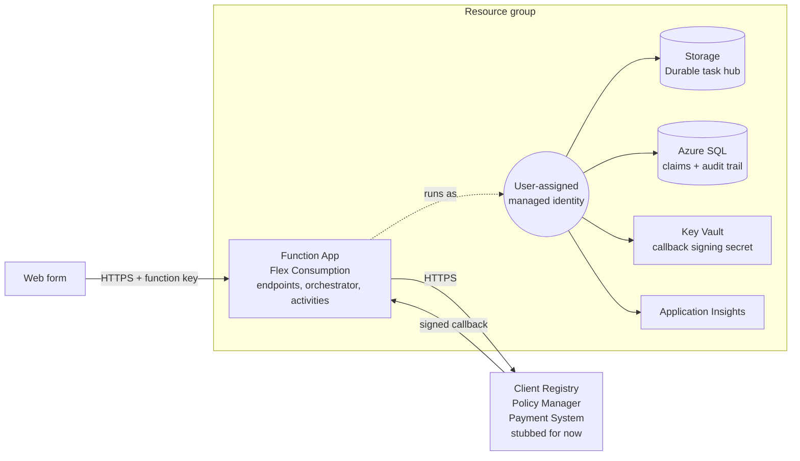

# Claims Processing System

A claims intake and settlement service for insurance claims, with death claims given the
tightest SLA. A claim is lodged over HTTP, then a Durable Functions orchestration validates
the claimant, confirms cover with the policy manager, instructs payment, and waits for the
provider to confirm the money actually moved.

Built on .NET 10 with Azure Functions (isolated worker), Durable Functions, EF Core and Azure SQL.

---

## Architecture

```
                    ┌──────────────────┐
   web form ───────▶│  SubmitClaim     │  POST /api/claims
                    │  (HTTP trigger)  │
                    └────────┬─────────┘
                             │ persists claim, starts orchestration
                             ▼
              ┌──────────────────────────────┐
              │ ClaimProcessingOrchestrator  │◀─── SLA timer runs alongside
              │  (durable, instance = claim) │
              └──────────────┬───────────────┘
                             │ calls activities
          ┌──────────────────┼──────────────────┐
          ▼                  ▼                  ▼
  ┌───────────────┐  ┌───────────────┐  ┌───────────────┐
  │ClientRegistry │  │ PolicyManager │  │   Payments    │   Claims.Integration
  └───────────────┘  └───────────────┘  └───────────────┘
          │                  │                  │
          └──────────────────┴──────────────────┘
                             │
                     ┌───────▼────────┐
                     │  Azure SQL     │   Claims.Persistence (EF Core)
                     └────────────────┘

   payment provider ──▶ POST /api/claims/{id}/payment-callback   (HMAC-signed)
                        raises PaymentCompleted on the orchestration, or settles
                        the claim directly if the orchestration has already ended
```

### Projects

| Project | Depends on | Holds |
|---|---|---|
| **Claims.Contracts** | — | Wire types: intake DTOs, integration request/response pairs, status responses, shared enums |
| **Claims.Domain** | Contracts | The `Claim` aggregate, its audit trail, `PriorityResolver`, `SlaPolicy` |
| **Claims.Persistence** | Domain, Contracts | `ClaimsDbContext`, EF configurations, `IClaimRepository`, migrations |
| **Claims.Integration** | Contracts | Typed HTTP clients for the three downstream systems, plus in-memory stubs |
| **Claims.Functions** | all of the above | HTTP endpoints, the orchestrator, the activities, intake validation |
| **Claims.UnitTests** | Domain, Integration, Functions | xUnit tests for the domain rules, SLA, callback signing, validation and payment activity |

Dependencies point inwards. `Claims.Domain` knows nothing about EF Core, HTTP or Azure — it can be
unit tested with no infrastructure at all.

---

## Why this design

**Durable Functions rather than a queue-driven worker.** Settling a claim is a multi-step
conversation with three external systems where the middle of it can take hours — the payment
provider accepts an instruction and calls back later. Hand-rolling that over queues means
inventing your own state machine, correlation and retry story. Durable gives checkpointing,
replay and timers, and the orchestrator reads as the sequence it actually is.

**The orchestration instance id is the claim id.** One identifier addresses both the claim and
its run. A status lookup and a settlement callback can each find what they need knowing only
which claim they are about — no correlation table, no second identifier to keep in step.

**A business refusal is a return value; a transport fault is an exception.** A 404 from the
client registry becomes `ClientValidationResult.Invalid(...)`, not a thrown exception. The
orchestrator branches on data, and Durable's retry machinery is reserved for faults that a retry
might actually fix. The payment client is deliberately stricter: only an explicit refusal is
converted, so an ambiguous failure is never retried into a second payment.

**Activities load the claim; they do not receive it.** Activity inputs carry a `ClaimId` and
little else. Orchestration history is durable storage — data put into it is written to the hub,
replayed on every rehydration, and can be stale by the time a later step runs. Reading the claim
at the point of use means each step works off current truth.

**The claim owns its own transitions.** Every state change goes through `Claim.Transition`, which
writes the audit entry and moves the status together, so history cannot drift from state. No
activity assigns `Status` directly.

---

## Key patterns

| Pattern | Where | Why |
|---|---|---|
| Aggregate with private setters | `Claim` | State only changes through methods that record why |
| Audit trail as a child collection | `ClaimStatusHistory` | Every transition and milestone is recorded, oldest first |
| Repository over `DbContext` | `IClaimRepository` | Activities depend on an interface, not EF |
| Typed `HttpClient` per system | `Claims.Integration` | Each downstream gets its own base address, timeout and resilience policy |
| Standard resilience handler | `AddStandardResilienceHandler()` | Retry, circuit breaker and timeout without hand-rolled Polly. Retries are off for payment POSTs |
| Activity retry policy | `ClaimProcessingOrchestrator.Retryable` | Transient faults are retried; a step that still fails marks the claim `Failed` |
| HMAC-signed webhook | `PaymentCallbackSignature` | Only the provider can settle a claim, and a captured callback cannot be replayed |
| Idempotent intake | `ChannelReference` + filtered unique index | A resent form returns the original claim instead of creating a second payout |
| Options pattern with `ValidateOnStart` | `IntegrationOptions` | A missing base address fails at startup, not on the first claim |
| External event + timer race | orchestrator step 5 | Bounds the wait for a settlement callback |
| Concurrent SLA timer | `RunAsync` | A stalled claim is flagged while it is still being worked |
| Stub swap via `RemoveAll` | `AddClaimsIntegrationStubs` | Local runs genuinely cannot reach the real systems |

---

## Claim lifecycle



`SlaBreached` is a flag, not a state: a breached claim keeps its status and stays in whatever
queue it was already in.

A timeout does not mean the money did not move. When a settlement callback arrives after the
orchestration has ended, `PaymentCallbackFunction` applies the outcome to the claim directly
instead of raising an event nothing is listening for. A repeated callback for a payment that is
no longer pending is acknowledged and ignored.

### The orchestration, step by step

`ClaimProcessingOrchestrator.RunStepsAsync` runs these in order, stopping at the first that
ends the claim. Every step except 5 retries transient faults; if one still fails,
`RunWorkflowAsync` marks the claim `Failed` with the step named.

1. **`MarkValidatingActivity`** — moves the claim to `Validating`.
2. **`VerifyClientActivity`** — resolves the claimant against the client registry. On a match,
   links the client id; otherwise `RejectClaimActivity` and stop.
3. **`VerifyPolicyActivity`** — confirms cover and records the authorised amount. The activity
   rejects the claim itself on a decline, so only a `bool` comes back.
4. **`ApproveClaimActivity`** — approves for the amount the policy manager authorised.
5. **`RequestPaymentActivity`** — instructs the provider to pay the approved amount. Never
   retried, so an instruction with an unknown outcome cannot become a second payment. A refusal
   is already recorded against the claim, so the orchestration just stops.
6. **Wait for `PaymentCompleted`** — raced against a timer of `PaymentWaitTimeout`. On timeout,
   `FailClaimActivity` and stop.
7. **`HandlePaymentCompletionActivity`** — applies the reported outcome.
8. **`CompleteClaimActivity`** — closes the claim.

Running alongside all of it, `CreateSlaTimer` waits out the claim's deadline and calls
`FlagSlaBreachActivity` if it passes first. Whichever finishes first, the workflow is still
awaited — a breach marks a claim late, it does not abandon it. The timer runs until the whole
workflow ends, so the deadline covers settlement too, not just assessment.

---

## SLA and priority handling

Priority comes from the type of cover alone. A death claim leaves a family without income
immediately, so value does not raise or lower urgency:

| Claim type | Priority | Turnaround window |
|---|---|---|
| Death | Critical | 4 hours |
| Funeral | High | 24 hours |
| Dread disease | High | 24 hours |
| Disability, anything else | Standard | 5 days |

`PriorityResolver.Resolve(claimType)` decides the priority at intake; `SlaPolicy.DeadlineFrom`
turns it into a deadline, stored on the claim as `Deadline`. Unmapped priorities fall back to
`SlaPolicy.DefaultWindow` (5 days).

Windows are **elapsed calendar time, not working hours** — a claim lodged on a Friday spends its
weekend. If the business measures turnaround in business days, `SlaPolicy` is the single place
that changes.

---

## The stubs

`Claims.Integration/Stubs` holds in-memory stand-ins for all three downstream systems, so the
whole flow can be exercised with nothing external running. Enable with `Integration:UseStubs=true`;
`AddClaimsIntegrationStubs` removes the real registrations first, so the configured endpoints
genuinely are not called.

They are driven by the shape of the request, so a test forces a path by choosing its inputs:

| System | Behaviour |
|---|---|
| **Client registry** | Matches any ID number that is not blank and does not end `0000`; returns `STUB-CLIENT-{id}` |
| **Policy manager** | Approves for the full amount, except: blank or `INVALID…` policy number, a number containing `LAPSED`, an unknown claim type, or an amount ≤ 0 |
| **Payments** | Accepts, then calls back. An account number ending `9999` settles as **failed** |

The payment stub is the interesting one: it answers the instruction immediately, then POSTs a
`PaymentCompletionNotification` to the request's callback URL after `AutoCompleteDelaySeconds`,
exactly as a real provider does. That exercises the webhook and the orchestration's waiting
branch end to end.

```jsonc
// local.settings.json → Values
"Payment:AutoCompletePayments": "true",
"Payment:AutoCompleteDelaySeconds": "5"
```

Set `AutoCompletePayments` to `false` to leave a payment pending and watch the timeout path
(`PaymentWaitTimeout`, 5 minutes by default).

---

## Running locally

### Prerequisites

- .NET 10 SDK
- [Azure Functions Core Tools v4](https://learn.microsoft.com/azure/azure-functions/functions-run-local) — `brew tap azure/functions && brew install azure-functions-core-tools@4`
- Azurite (storage emulator) — `npm install -g azurite`
- SQL Server — Docker is easiest

### 1. Start the dependencies

```bash
azurite --silent --location ./.azurite &

docker run -d --name claims-sql \
  -e ACCEPT_EULA=Y -e MSSQL_SA_PASSWORD='Your_password123' \
  -p 1433:1433 mcr.microsoft.com/mssql/server:2022-latest
```

### 2. Create the database

The EF tooling is pinned as a local tool, so run it through `dotnet`:

```bash
export ClaimsDbConnection='Server=localhost,1433;Database=Claims;User Id=sa;Password=Your_password123;TrustServerCertificate=True'

dotnet tool restore
dotnet dotnet-ef database update --project src/Claims.Persistence
```

### 3. Configure the app

`src/Claims.Functions/local.settings.json` is gitignored because it holds connection strings,
so a fresh clone does not have one. Create it with:

```jsonc
{
  "IsEncrypted": false,
  "Values": {
    "AzureWebJobsStorage": "UseDevelopmentStorage=true",
    "FUNCTIONS_WORKER_RUNTIME": "dotnet-isolated",

    "ClaimsSqlConnectionString": "Server=localhost,1433;Database=Claims;User Id=sa;Password=Your_password123;TrustServerCertificate=True",

    "Integration:UseStubs": "true",
    "Integration:ClientRegistry:BaseAddress": "https://localhost/registry",
    "Integration:PolicyManager:BaseAddress": "https://localhost/policies",
    "Integration:Payments:BaseAddress": "https://localhost/payments",

    "Payment:AutoCompletePayments": "true",
    "Payment:AutoCompleteDelaySeconds": "5",
    "Payment:CallbackSigningSecret": "local-dev-callback-secret-not-for-production"
  }
}
```

In Azure these become app settings, with `__` in place of `:` (for example
`Integration__UseStubs`). The app refuses to start without `ClaimsSqlConnectionString` or
`Payment:CallbackSigningSecret`. In Azure the connection string would carry no password (the app
signs in with its managed identity) and the signing secret would be a Key Vault reference — see
*Cloud deployment approach*.

Base addresses are required even with stubs enabled — `ValidateOnStart` checks them before the
stub swap happens.

### 4. Run

```bash
cd src/Claims.Functions
func start
```

### 5. Submit a claim

```bash
curl -s -X POST http://localhost:7071/api/claims \
  -H 'Content-Type: application/json' \
  -d '{
    "channel": "WebForm",
    "channelReference": "FORM-0001",
    "claimType": 2,
    "claimant": {
      "firstName": "Thandi", "lastName": "Mokoena",
      "identityNumber": "9001015800087",
      "emailAddress": "thandi@example.com"
    },
    "policy": { "policyNumber": "POL-100200", "policyholderIdNumber": "9001015800087" },
    "incident": {
      "incidentDate": "2026-09-01",
      "description": "Funeral cover claim",
      "claimAmount": 25000.00, "currency": "ZAR"
    },
    "bankingDetails": {
      "accountHolder": "T Mokoena", "accountNumber": "62001234567",
      "branchCode": "250655", "bankName": "Example Bank"
    }
  }'
```

`claimType` accepts a name (`"Funeral"`) or its number (`1` Death, `2` Funeral, `3` Disability,
`4` DreadDisease). Then poll the status with the `claimId` from the response:

```bash
curl -s http://localhost:7071/api/claims/{claimId} | jq
```

Within a few seconds the stub payment provider calls back and the claim reaches `Completed`,
with the whole journey in `history`.

To watch the failure paths: an account number ending `9999` fails at settlement, a policy number
containing `LAPSED` is declined, and an ID number ending `0000` fails client validation. Give each
of these a new `channelReference`: sending a reference again returns `200` with the original
claim rather than creating a new one, which is the idempotency working. Leave out a required
field and you get `400` with every problem listed by field path.

`func start` does not enforce function keys locally. In Azure, `POST /api/claims` and
`GET /api/claims/{claimId}` need a key (`?code=` or `x-functions-key`); the payment callback is
authenticated by its signature instead.

### Endpoints

| Method | Route | Auth | Purpose |
|---|---|---|---|
| `POST` | `/api/claims` | Function key | Lodge a claim, start the orchestration |
| `GET` | `/api/claims/{claimId}` | Function key | Current status and full audit trail |
| `POST` | `/api/claims/{claimId}/payment-callback` | HMAC signature | Provider's settlement notification |

### Tests

```bash
dotnet test ClaimsProcessingSystem.slnx
```

---

## Azure integration in the code

What the service already relies on or accounts for, independent of how it is hosted:

| Service | Used for |
|---|---|
| **Azure Functions** (isolated worker, .NET 10) | Hosts the endpoints, orchestrator and activities |
| **Durable Functions** | Orchestration state, timers, external events. Task hub `ClaimsProcessing` |
| **Azure Storage** | Backs the Functions host and the Durable task hub (`AzureWebJobsStorage`; Azurite locally) |
| **Azure SQL** | Claims and audit trail, via EF Core with `EnableRetryOnFailure()` |
| **Application Insights** | Traces and logs, wired up in `Program.cs` |

**Identity-ready configuration.** Nothing in the code assumes a password or key. The SQL connection
string accepts `Authentication=Active Directory Managed Identity`, the Functions host accepts
identity-based storage settings, and every secret is read from configuration, so moving to managed
identity and Key Vault is a configuration change rather than a code change.

**Transient faults** are expected rather than exceptional on Azure SQL, which throttles under
load and drops idle connections, so the context is registered with `EnableRetryOnFailure()`.
Outbound calls to the three downstream systems go through
`AddStandardResilienceHandler()` — retry with backoff, circuit breaker and per-attempt timeout.
Payment instructions are the exception: a POST that timed out may still have been taken, so it is
never retried automatically. The same rule holds one level up — every activity runs under a retry
policy except `RequestPaymentActivity`. If a step still fails, the claim is marked `Failed` with the
step named, and a failed payment instruction is flagged for reconciliation before anyone reinstructs.

**Callback authentication.** The provider signs each callback with HMAC-SHA256 over
`{timestamp}.{body}` using a shared secret, sent in `X-Payment-Timestamp` and `X-Payment-Signature`.
The callback is refused with `401` if the signature is wrong or the timestamp is more than
`Payment:SignatureTolerance` (default 5 minutes) away, and with `400` if the claim id or payment
reference does not match the claim. The stub signs its callbacks the same way.

**Migrations** are applied out of band, not at startup, as an idempotent script that is safe to run
against a database at any earlier migration:

```bash
dotnet dotnet-ef migrations script --idempotent --project src/Claims.Persistence
```

---

## Running on Azure

The service is deployed and working end to end, on the stubs. `infra/` holds the Bicep that
creates it: one resource group, one module per concern.



**Azure Functions on Flex Consumption.** Claims arrive in bursts, so the service scales to zero when
idle and out quickly under load. The plan supports Durable Functions and VNet integration, which the
older Consumption plan does not. A maximum instance count caps concurrent load on SQL and the
downstream systems.

**No secrets in configuration.** The app runs as a user-assigned managed identity, and every
connection uses it:

| Connection | How |
|---|---|
| Storage (host + Durable) | `AzureWebJobsStorage__credential=managedidentity`, shared-key access disabled on the account |
| Azure SQL | `Authentication=Active Directory Managed Identity`, server set to Entra-only authentication |
| Key Vault | `@Microsoft.KeyVault(SecretUri=…)` app setting for the callback signing secret |
| Application Insights | `Authorization=AAD`, key-based ingestion disabled |

The identity holds only what it needs: Blob Data Owner, Queue and Table Data Contributor on the
storage account, Key Vault Secrets User on the vault, Monitoring Metrics Publisher on Application
Insights, and `db_datareader`/`db_datawriter` in the database. It is user-assigned rather than
system-assigned so its role assignments and database user can be created before the app exists and
survive the app being recreated.

### Deploying

```bash
az group create --name rg-claims-prod --location southafricanorth

export SQL_ADMIN_LOGIN='you@example.com' \
       SQL_ADMIN_OBJECT_ID='<your Entra object id>' \
       PAYMENT_CALLBACK_SIGNING_SECRET="$(openssl rand -hex 32)"

az deployment group create --resource-group rg-claims-prod \
  --template-file infra/main.bicep --parameters infra/main.bicepparam \
  --parameters sqlAdminPrincipalType=User
```

Then apply the migration script to the new database, create the database user for the app identity
(from its client id, because database users cannot be created through ARM), and deploy the code:

```bash
dotnet publish src/Claims.Functions/Claims.Functions.csproj -c Release -o publish
(cd publish && zip -qr ../functions.zip .)
az functionapp deployment source config-zip -g rg-claims-prod -n <function app name> --src functions.zip
```

Switching from the stubs to the real systems is configuration only: set `Integration__UseStubs` to
`false` and supply the three base addresses.

### For production

Deliberately left out, in the order I would add them:

1. **API Management** with Entra ID in front of the endpoints, replacing function keys.
2. **Private endpoints** and VNet integration for SQL, Storage and Key Vault.
3. **Alerts** on SLA breaches, claims marked `Failed`, and open circuit breakers.
4. **CI/CD** with OIDC federation, so deployments are not run from a laptop.
5. **Claim status events** on Service Bus, so the existing Claims System is told rather than polling.

---

## Known gaps

Worth knowing before this handles real claims:

- **Function keys are shared secrets, not user identity.** Any holder of the key can read any
  claim, until API Management with Entra ID is in front (see *For production*).
- **Idempotency depends on the channel sending `channelReference`.** A submission without one is
  still created every time it is sent, and if its orchestration fails to start, nothing retries it.
- **Bank account numbers are stored in plain text** in the `Claims` table. Always Encrypted, or a
  separate table with tighter access, before production.
- **No SLA scanner for claims outside an orchestration.** The SLA timer only covers a claim while
  its orchestration is running.
- **Unit tests only.** The orchestrator and the HTTP functions have no tests; they need the
  Durable Task test harness or an integration run against Azurite and SQL Server.
- **A zero-second stub settlement delay races the payment reference.** The callback is checked
  against the reference the payment activity saves, so a callback sent before that save is refused.
- **A callback can still be lost in a narrow window.** If it arrives while the orchestration is
  running but has already taken the timeout branch, the event is accepted and then ignored.
